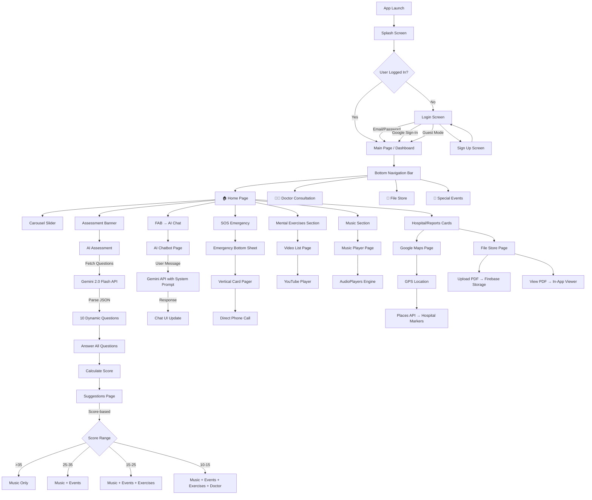

# BeyondPeace — Detailed Architecture & Documentation

This document provides an exhaustive description of the BeyondPeace application including its architecture, navigation flow, feature-level working, data flow, API integrations, and component hierarchy.

---

## Table of Contents

1. [High-Level Architecture](#1-high-level-architecture)
2. [Application Flow Diagram](#2-application-flow-diagram)
3. [Directory Structure](#3-directory-structure)
4. [Navigation & Routing](#4-navigation--routing)
5. [Authentication Flow](#5-authentication-flow)
6. [Feature Deep Dives](#6-feature-deep-dives)
   - 6.1 [AI-Powered Assessment](#61-ai-powered-assessment)
   - 6.2 [AI Chatbot (MindHelper)](#62-ai-chatbot-mindhelper)
   - 6.3 [Emergency SOS](#63-emergency-sos)
   - 6.4 [Nearby Hospital Finder](#64-nearby-hospital-finder)
   - 6.5 [Music Therapy Player](#65-music-therapy-player)
   - 6.6 [Brain Exercise Videos](#66-brain-exercise-videos)
   - 6.7 [Medical Report Storage](#67-medical-report-storage)
   - 6.8 [Doctor Consultation](#68-doctor-consultation)
   - 6.9 [Special Wellness Events](#69-special-wellness-events)
7. [API Integration Details](#7-api-integration-details)
8. [Firebase Schema](#8-firebase-schema)
9. [State Management](#9-state-management)
10. [UI/UX Design System](#10-uiux-design-system)
11. [Assets Inventory](#11-assets-inventory)
12. [Docker & Deployment](#12-docker--deployment)
13. [Component Hierarchy Tree](#13-component-hierarchy-tree)

---

## 1. High-Level Architecture

```
┌─────────────────────────────────────────────────────────────────────────┐
│                         BeyondPeace Application                        │
├─────────────────────────────────────────────────────────────────────────┤
│                                                                         │
│  ┌─────────────┐  ┌──────────────┐  ┌──────────────┐  ┌─────────────┐ │
│  │  Auth Layer  │  │  UI / Pages  │  │  API Layer   │  │  Data Layer │ │
│  │             │  │              │  │              │  │             │ │
│  │ • Firebase  │  │ • Homepage   │  │ • Gemini AI  │  │ • Firestore │ │
│  │   Auth      │  │ • Assessment │  │ • Google     │  │ • Firebase  │ │
│  │ • Google    │  │ • Chatbot    │  │   Maps API   │  │   Storage   │ │
│  │   Sign-In   │  │ • Maps       │  │ • Google     │  │ • Local     │ │
│  │ • Guest     │  │ • Music      │  │   Places API │  │   Assets    │ │
│  │             │  │ • Videos     │  │ • HTTP/REST  │  │ • JSON      │ │
│  │             │  │ • File Store │  │              │  │             │ │
│  │             │  │ • Doctor     │  │              │  │             │ │
│  │             │  │ • Events     │  │              │  │             │ │
│  └─────────────┘  └──────────────┘  └──────────────┘  └─────────────┘ │
│                                                                         │
└─────────────────────────────────────────────────────────────────────────┘
```

### Architecture Pattern

BeyondPeace follows a **widget-centric architecture** with direct API calls from StatefulWidgets. Each page manages its own state via `setState()`. There is no separate service/repository layer — API calls and business logic reside within page widgets.

| Aspect | Approach |
|---|---|
| **State Management** | `setState()` in StatefulWidgets |
| **Navigation** | `MaterialPageRoute` + `Navigator.push/pop` |
| **API Calls** | Direct HTTP calls from within widgets |
| **Data Persistence** | Firebase (Auth, Firestore, Storage) |
| **Dependency Injection** | None (global constants in `api.dart`) |
| **Error Handling** | try/catch with Fluttertoast notifications |

---

## 2. Application Flow Diagram



---

## 3. Directory Structure

```
lib/
├── main.dart                    # App entry point, Firebase init, MaterialApp, routes
├── api.dart                     # API keys (Gemini, Google Maps)
├── firebase_options.dart        # Auto-generated Firebase config
├── videolist.json               # JSON data for brain exercise videos
│
├── pages/
│   ├── login.dart               # Login page (Firebase Auth + Google Sign-In)
│   ├── sign.dart                # Registration page
│   ├── mainpage.dart            # Tab container with CurvedNavigationBar
│   ├── homepage.dart            # Main dashboard (651 lines)
│   ├── assesment.dart           # AI-powered dynamic mental health assessment
│   ├── suggestions.dart         # Score-based personalized recommendations
│   ├── Chatpage.dart            # AI chatbot "MindHelper" (Gemini 2.0 Flash)
│   ├── doctor.dart              # Psychiatrist directory with consultation links
│   ├── specialevent.dart        # Wellness events listing
│   ├── filestore.dart           # PDF upload/view with Firebase Storage
│   │
│   ├── Maps/
│   │   ├── Maps.dart            # Google Maps + Places API integration
│   │   ├── NearbyPlacesResponse.dart  # JSON model for Places API (249 lines)
│   │   ├── PinInformation.dart  # Map marker data model
│   │   └── MapPinPillComponent.dart   # Marker info popup widget
│   │
│   ├── music/
│   │   ├── musicpage.dart       # Music player page with mini/full player
│   │   ├── model.dart           # MusicModel class with 4 tracks
│   │   ├── AudioFile.dart       # AudioPlayers integration + controls
│   │   └── MusicTile.dart       # Reusable music list item widget
│   │
│   └── video/
│       ├── VideoListPage.dart   # Video list with thumbnails
│       ├── videomodel.dart      # Video data model
│       ├── Video_tile.dart      # Video list item widget
│       └── videopage.dart       # YouTube player page
│
├── components/
│   └── drawer.dart              # Navigation drawer with user profile
│
└── utils/
    └── glassmorphism_card.dart  # Reusable glass-morphism styled container
```

---

## 4. Navigation & Routing

### Entry Point (`main.dart`)

```
main() → Firebase.initializeApp() → runApp(MaterialApp)
```

The `MaterialApp` defines named routes:

| Route | Widget | Description |
|---|---|---|
| `/` | `Loginpage` | Default route — login screen |
| `/signup` | `Signpage` | User registration |
| `/mainpage` | `Mainpage` | Tab container after login |
| `/video_page` | `VideoPage` | YouTube video player |
| `/chatbot` | `Chatpage` | AI chatbot interface |

### Tab Navigation (`mainpage.dart`)

Uses `CurvedNavigationBar` with 4 tabs managed by `PageController`:

| Index | Icon | Page | Description |
|---|---|---|---|
| 0 | 🏠 Home | `Homepage` | Main dashboard |
| 1 | 📞 Phone | `Doctorcall` | Doctor consultation |
| 2 | 📁 Folder | `Filestorepage` | Medical reports |
| 3 | 🎊 Event | `specialevent` | Wellness events |

The navigation bar has a deep purple background (`#5c3ec8`), grey inactive items, and white active item. The `Mainpage` also hosts the `Drawerpage` in its Scaffold drawer.

### In-Page Navigation

All internal navigation uses `Navigator.push(MaterialPageRoute(...))`:
- Home → Assessment → Suggestions
- Home → Music Player
- Home → Video List → Video Player
- Home → Maps
- Home → File Store
- Home FAB → AI Chatbot

---

## 5. Authentication Flow

### Login Flow (`login.dart`)

```
┌──────────────────────────────────────────────────┐
│                  Login Screen                     │
├──────────────────────────────────────────────────┤
│                                                    │
│  ┌─────────────────────────────┐                  │
│  │  Email + Password Fields    │                  │
│  │  → FirebaseAuth.signIn()    │──→ /mainpage     │
│  └─────────────────────────────┘                  │
│                                                    │
│  ┌─────────────────────────────┐                  │
│  │  Google Sign-In Button      │                  │
│  │  → GoogleSignIn.signIn()    │                  │
│  │  → GoogleAuth → credential  │                  │
│  │  → FirebaseAuth.signIn()    │──→ /mainpage     │
│  │  → Firestore user profile   │                  │
│  └─────────────────────────────┘                  │
│                                                    │
│  ┌─────────────────────────────┐                  │
│  │  Guest Mode Button          │                  │
│  │  → Direct navigate          │──→ /mainpage     │
│  └─────────────────────────────┘                  │
│                                                    │
│  → "Don't have an account?"   ──→ /signup         │
└──────────────────────────────────────────────────┘
```

### Registration Flow (`sign.dart`)

1. Collect: Name, Email, Password, Confirm Password
2. Validate password match
3. `FirebaseAuth.createUserWithEmailAndPassword()`
4. Save profile to Firestore: `users/{uid}` → `{name, email, uid}`
5. Navigate to `/mainpage`

### Guest Mode

Skips authentication and navigates directly to `/mainpage`. Guest users cannot access Firebase-dependent features (file storage, profile).

---

## 6. Feature Deep Dives

### 6.1 AI-Powered Assessment

**File:** `lib/pages/assesment.dart`

#### How It Works

1. **Question Generation**: On page initialization (`initState`), the app sends an HTTP POST request to **Google Gemini 2.0 Flash** with a carefully crafted prompt:
   - Requests exactly 10 multiple-choice questions about mental health
   - Specifies JSON format with fields: `question`, `option1`–`option4`
   - Topics: mood, sleep, stress, social interactions, energy, appetite, anxiety, concentration, self-esteem, daily functioning

2. **Prompt Engineering**: The prompt explicitly asks for a JSON array format to facilitate reliable parsing:
   ```
   "Generate exactly 10 multiple-choice questions for a mental health
    self-assessment... Return ONLY a valid JSON array..."
   ```

3. **Response Parsing**: The API response is cleaned (markdown code fences stripped), parsed as JSON, and converted into a list of question maps.

4. **Fallback Mechanism**: If the API call fails (network error, timeout, malformed response), the app falls back to 10 pre-defined static questions stored in `_fallbackQuestions`.

5. **Scoring Algorithm**:
   - Each question has 4 options
   - Scoring per option: option1 = 4 pts, option2 = 3 pts, option3 = 2 pts, option4 = 1 pt
   - Maximum score: 40 points (10 questions × 4 pts)
   - Minimum score: 10 points (10 questions × 1 pt)

6. **UI Flow**: Linear question progression with "Next" button. Each question displayed in a purple-gradient card with radio-button options. Final question shows "Submit" instead of "Next".

7. **Result**: Total score is passed to `SuggestionsPage` which displays tier-based recommendations.

#### Scoring Breakdown

```
Score: 36-40  →  Excellent mental health
Score: 25-35  →  Good, minor areas of improvement
Score: 15-24  →  Needs improvement, multiple support tools recommended
Score: 10-14  →  Needs professional support
```

#### Data Flow Diagram

```
┌──────────┐    HTTP POST     ┌──────────────────┐
│ App Init │───────────────→  │ Gemini 2.0 Flash │
│ (assess- │                  │ API Endpoint     │
│  ment)   │  ←───────────── │                  │
└──────────┘    JSON Array    └──────────────────┘
     │                              │
     │ (Success)                    │ (Failure)
     ▼                              ▼
┌─────────────┐            ┌─────────────────┐
│ Parse JSON  │            │ _fallbackQuest-  │
│ → 10 Q's    │            │  ions (static)   │
└─────────────┘            └─────────────────┘
     │                              │
     └──────────┬───────────────────┘
                ▼
        ┌───────────────┐
        │ Display Q's   │
        │ one-by-one    │
        └───────────────┘
                │
                ▼
        ┌───────────────┐
        │ Score:         │
        │ Σ (option_pts) │
        └───────────────┘
                │
                ▼
        ┌───────────────┐
        │ Suggestions   │
        │ Page (tiered) │
        └───────────────┘
```

---

### 6.2 AI Chatbot (MindHelper)

**File:** `lib/pages/Chatpage.dart`

#### How It Works

1. **UI Framework**: Uses the `DashChat 2` package for a WhatsApp-like chat interface. Two `ChatUser` objects represent the user and the AI bot ("MindHelper").

2. **Message Processing**: When the user sends a message:
   - A system instruction is prepended: *"You are an empathetic mental health assistant named MindHelper..."*
   - The combined message is sent to Gemini 2.0 Flash via HTTP POST
   - The AI response is parsed and displayed as a bot message

3. **Domain Restriction**: The system prompt restricts responses to mental health topics only. Off-topic queries receive a polite redirect.

4. **System Prompt Details**:
   - Role: Empathetic mental health assistant
   - Behavior: Concise (under 100 words), supportive, non-diagnostic
   - Boundaries: Suggests professional help for serious concerns
   - Restriction: Only responds to mental health topics

5. **Message History**: All messages are stored in a local list (`_messages`) for the session. History is not persisted across sessions.

#### Chat Architecture

```
User Message
    │
    ▼
┌──────────────────────────────────────────┐
│ System Prompt + User Message             │
│ "You are an empathetic mental health     │
│  assistant... [User's actual message]"   │
└──────────────────────────────────────────┘
    │
    ▼ HTTP POST
┌──────────────────────────────────────────┐
│ Gemini 2.0 Flash API                     │
│ generativelanguage.googleapis.com        │
│ /v1beta/models/gemini-2.0-flash:         │
│   generateContent                        │
└──────────────────────────────────────────┘
    │
    ▼ JSON Response
┌──────────────────────────────────────────┐
│ Parse: candidates[0].content.parts[0]   │
│         .text                            │
└──────────────────────────────────────────┘
    │
    ▼
┌──────────────────────────────────────────┐
│ DashChat UI → Bot Message Bubble         │
└──────────────────────────────────────────┘
```

---

### 6.3 Emergency SOS

**File:** `lib/pages/homepage.dart` (SOS section within homepage)

#### How It Works

1. **Trigger**: Red "SOS" icon button in the top-right AppBar of the homepage
2. **UI**: Opens a `showModalBottomSheet` containing a `VerticalCardPager`
3. **Cards**: 5 emergency contact cards, each with an icon, label, and phone number:

   | Card | Label | Number | Icon |
   |---|---|---|---|
   | 1 | Ambulance | 102 | ambulance.png |
   | 2 | Police | 100 | police.png |
   | 3 | Fire | 101 | fire.png |
   | 4 | Women's Helpline | 181 | women.png |
   | 5 | Personal Contact | (saved) | emergency.png |

4. **Calling**: Uses `flutter_phone_direct_caller` to launch direct phone calls without the dialer intermediary.
5. **Swipeable Interface**: Users can swipe vertically through cards in the bottom sheet for quick selection.

---

### 6.4 Nearby Hospital Finder

**File:** `lib/pages/Maps/Maps.dart`

#### How It Works

1. **Location Permission**: Requests GPS permission via `Geolocator`
2. **Current Position**: Gets device latitude/longitude
3. **Map Display**: Renders `GoogleMap` widget with hybrid (satellite + labels) map type
4. **Hospital Search**: Calls **Google Places Nearby Search API**:
   ```
   GET https://maps.googleapis.com/maps/api/place/nearbysearch/json
       ?location={lat},{lng}
       &radius=10000
       &type=hospital
       &key={API_KEY}
   ```
5. **Response Parsing**: Uses `NearbyPlacesResponse` model (249 lines) to deserialize the JSON response including place names, addresses, geometry, photos, ratings, and opening hours
6. **Markers**: Each hospital is placed on the map as a red marker with an `InfoWindow` showing the place name
7. **Info Pill**: Tapping a marker shows a `MapPinPillComponent` overlay at the bottom with place details

#### Supporting Models

- **NearbyPlacesResponse**: Full Google Places API response model with nested classes for `Results`, `Geometry`, `Location`, `Photos`, `OpeningHours`
- **PinInformation**: Holds marker-specific data: `placeName`, `pinPath`, `avatarPath`, `labelColor`, `location`
- **MapPinPillComponent**: Animated bottom panel showing selected place details

---

### 6.5 Music Therapy Player

**Files:** `lib/pages/music/musicpage.dart`, `model.dart`, `AudioFile.dart`, `MusicTile.dart`

#### How It Works

1. **Music Data**: `MusicModel` defines 4 curated tracks with metadata:
   - Brain Healing Music (7:16)
   - Study Focus Music (5:01)
   - Study Music (7:16)
   - Meditation Music (6:30)

2. **Audio Source**: MP3 files stored locally in `assets/audio/`

3. **Playback Engine**: Uses `AudioPlayers` package:
   - `AudioPlayer` instance manages playback
   - Asset source: `AudioSource.asset('assets/audio/{filename}')`
   - Controls: Play, Pause, Stop, Next, Previous
   - Progress: `StreamSubscription` listeners for position and duration

4. **UI Structure**:
   - **Music List**: Scrollable list of `MusicTile` widgets with album art, title, artist, duration
   - **Mini Player**: Collapsed bar at bottom showing current track + play/pause
   - **Full Player**: Expanded view with large artwork, progress bar, and full controls
   - **Toggle**: `AnimatedContainer` animates between mini and full player states

#### Player State Machine

```
┌─────────┐  tap track  ┌──────────┐  play()   ┌─────────┐
│  IDLE   │────────────→ │ LOADING  │─────────→ │ PLAYING │
└─────────┘              └──────────┘           └─────────┘
                                                    │  │
                                        pause() │  │ complete()
                                                    ▼  ▼
                                              ┌──────────┐
                                              │  PAUSED  │
                                              │  / DONE  │
                                              └──────────┘
```

---

### 6.6 Brain Exercise Videos

**Files:** `lib/pages/video/VideoListPage.dart`, `videomodel.dart`, `Video_tile.dart`, `videopage.dart`

#### How It Works

1. **Data Source**: `lib/videolist.json` contains an array of video objects:
   ```json
   {
     "name": "10 Brain Exercises",
     "video_url": "https://www.youtube.com/watch?v=...",
     "image_url": "https://img.youtube.com/vi/.../0.jpg"
   }
   ```

2. **Video List Page**: Loads JSON data, displays as a scrollable list of `Videotile` widgets. Each tile shows the YouTube thumbnail and title.

3. **Video Playback**: Tapping a tile navigates to `VideoPage` which renders a `YoutubePlayerBuilder` + `YoutubePlayer` for in-app playback with autoplay enabled.

4. **Video Library** (4 videos):
   - 10 Brain Exercises to Keep Your Mind Sharp
   - 10 Brain Gym Exercises | Easy Brain Exercises to Improve Focus & Memory
   - 5 min Concentration Exercise
   - Brain Exercises for Focus and Coordination

---

### 6.7 Medical Report Storage

**File:** `lib/pages/filestore.dart`

#### How It Works

1. **Upload Flow**:
   - User taps "Upload" FAB
   - `FilePicker` opens native file browser (PDF filter)
   - Selected file is uploaded to **Firebase Storage** at path `pdfs/{filename}`
   - File metadata (name, URL, timestamp) saved to **Cloud Firestore** collection `pdfs`

2. **List View**: `StreamBuilder` listens to Firestore `pdfs` collection, displays real-time list of uploaded files sorted by timestamp

3. **PDF Viewer**: Tapping a file opens it with `easy_pdf_viewer` (`PDFViewer`) for full in-app PDF rendering

4. **Refresh**: `LiquidPullToRefresh` provides visual feedback on pull-to-refresh

#### Upload Data Flow

```
┌──────────┐   pick()   ┌──────────┐   upload()   ┌────────────────┐
│ FilePicker│──────────→ │ PDF File │────────────→  │ Firebase       │
│          │            │ (local)  │               │ Storage        │
└──────────┘            └──────────┘               │ /pdfs/{name}   │
                                                    └────────────────┘
                                                           │
                                                    getDownloadURL()
                                                           │
                                                           ▼
                                                    ┌────────────────┐
                                                    │ Cloud Firestore│
                                                    │ pdfs/{doc}     │
                                                    │ {name, url,    │
                                                    │  timestamp}    │
                                                    └────────────────┘
```

---

### 6.8 Doctor Consultation

**File:** `lib/pages/doctor.dart`

#### How It Works

1. **Data**: 6 hardcoded psychiatrist profiles with name, specialty, and avatar image
2. **UI**: Glass-morphism styled cards (`GlassMorphism` widget) in a scrollable list
3. **Consultation**: "Click" button opens an external chat-based consultation platform via `url_launcher` (using `launchUrl`)
4. **Design**: Each card has a circular avatar, doctor name, specialty text, and a CTA button

---

### 6.9 Special Wellness Events

**File:** `lib/pages/specialevent.dart`

#### How It Works

1. **Data**: 5 hardcoded wellness events:
   - Stress Reduction Workshop (stress.png)
   - Laughter Club Session (club.jpg)
   - Guided Meditation Session (medi.jpeg)
   - Mindful Breathing Exercise (breath.jpg)
   - Yoga and Meditation Class (yoga.jpg)

2. **UI**: Vertical list of event cards with image, title, date/time, and "Register" button
3. **Registration**: External URL via `url_launcher`
4. **Design**: Purple/indigo gradient cards with rounded corners and shadow

---

## 7. API Integration Details

### Gemini 2.0 Flash (Google Generative AI)

| Property | Value |
|---|---|
| **Endpoint** | `https://generativelanguage.googleapis.com/v1beta/models/gemini-2.0-flash:generateContent` |
| **Method** | HTTP POST |
| **Auth** | API key in query parameter (`?key=`) |
| **Content-Type** | `application/json` |
| **Request Body** | `{"contents": [{"parts": [{"text": "..."}]}]}` |
| **Response Path** | `candidates[0].content.parts[0].text` |
| **Used In** | Assessment (question generation), Chatbot (conversational AI) |
| **Key File** | `lib/api.dart` → `geminiApiKey` |

### Google Maps SDK

| Property | Value |
|---|---|
| **Package** | `google_maps_flutter` |
| **Map Type** | Hybrid (satellite + labels) |
| **Used In** | Hospital finder page |
| **Key Config** | Android Manifest + `api.dart` |

### Google Places Nearby Search

| Property | Value |
|---|---|
| **Endpoint** | `https://maps.googleapis.com/maps/api/place/nearbysearch/json` |
| **Method** | HTTP GET |
| **Parameters** | `location`, `radius` (10km), `type=hospital`, `key` |
| **Response Model** | `NearbyPlacesResponse` (249-line Dart model) |
| **Key File** | `lib/api.dart` → `googleApiKey` |

### Firebase Services

| Service | Usage | Package |
|---|---|---|
| **Firebase Auth** | Email/password + Google Sign-In | `firebase_auth` |
| **Cloud Firestore** | User profiles (`users/`), PDF metadata (`pdfs/`) | `cloud_firestore` |
| **Firebase Storage** | PDF file uploads (`pdfs/{filename}`) | `firebase_storage` |

---

## 8. Firebase Schema

### Firestore Collections

```
firestore/
├── users/
│   └── {uid}/
│       ├── name: string
│       ├── email: string
│       └── uid: string
│
└── pdfs/
    └── {auto-id}/
        ├── name: string        # Original filename
        ├── url: string         # Firebase Storage download URL
        └── timestamp: timestamp # Upload time
```

### Storage Structure

```
firebase-storage/
└── pdfs/
    ├── report1.pdf
    ├── report2.pdf
    └── ...
```

---

## 9. State Management

BeyondPeace uses **vanilla Flutter state management** (`setState()` within `StatefulWidget`). There is no external state management library (Provider, Riverpod, BLoC, etc.).

### State Patterns Used

| Pattern | Example | File |
|---|---|---|
| **Local State** | Current question index, selected option | `assesment.dart` |
| **Async State** | Loading indicator during API calls | `assesment.dart`, `Chatpage.dart` |
| **Stream State** | `StreamBuilder` for Firestore real-time data | `filestore.dart` |
| **Animation State** | Mini/full player toggle | `musicpage.dart` |
| **Controller State** | `PageController` for tab navigation | `mainpage.dart` |

### Data Flow Pattern

```
  User Action
      │
      ▼
  Widget Method
      │
      ├──→ API Call (HTTP / Firebase)
      │         │
      │         ▼
      │    Response Data
      │         │
      └─────────┘
      │
      ▼
  setState(() { ... })
      │
      ▼
  Widget Rebuild
```

---

## 10. UI/UX Design System

### Theme

| Property | Value |
|---|---|
| **Primary Color** | Deep Purple (`Colors.deepPurple`) |
| **Background** | White |
| **AppBar Style** | Transparent/Custom gradient per page |
| **Font Family** | Google Fonts — varies by page (Poppins, MuseoModerno, Ubuntu, etc.) |
| **Scaffold** | `extendBodyBehindAppBar: true` used on homepage |

### Design Components

| Component | Description | Used In |
|---|---|---|
| **Glass-morphism Cards** | Frosted glass effect with `BackdropFilter` + semi-transparent container | Doctor, Homepage |
| **Gradient Backgrounds** | Purple/blue/pink linear gradients | Assessment, SOS, Login |
| **Carousel Slider** | Auto-playing image/card slider | Homepage |
| **Curved Navigation Bar** | Bottom nav with curved notch animation | Mainpage |
| **Liquid Pull-to-Refresh** | Liquid animation on pull-to-refresh | File Store |
| **Vertical Card Pager** | Swipeable vertical card stack | SOS Emergency |
| **Animated Containers** | Smooth height transitions | Music Player |

### Color Palette

```
Primary:     #673AB7  (Deep Purple)
Secondary:   #5c3ec8  (Nav Bar Purple)
Accent:      #7C4DFF  (Purple Accent)
Background:  #FFFFFF  (White)
Card:        rgba(255,255,255,0.15) (Glassmorphism)
Gradient 1:  #7B1FA2 → #E040FB (Purple gradient)
Gradient 2:  #1A237E → #283593 (Dark blue gradient)
Emergency:   #F44336  (Red for SOS)
```

---

## 11. Assets Inventory

### Images (`assets/images/`)

| File | Usage |
|---|---|
| `ambulance.png` | SOS - Ambulance card |
| `apple.jpg` | Carousel/Card |
| `asses.png` | Assessment banner |
| `brain.jpg` | Brain exercises section |
| `breath.jpg` | Mindful breathing event |
| `chatbot.jpg` | Chatbot header |
| `club.jpg` | Laughter club event |
| `cons.png` | Consultation card |
| `doc.jpg` | Doctor card |
| `emergency.png` | Personal emergency contact |
| `exer.png` | Exercise section |
| `exercise1-4.png` | Exercise cards |
| `fire.png` | SOS - Fire card |
| `google.jpg` | Google Sign-In button |
| `gratitude.jpg` | Gratitude card |
| `icon.png` | App icon |
| `meddoc.png` | Medical document section |
| `medi.jpeg` | Meditation event |
| `mus.png` | Music section |
| `music1-4.png` | Music album art |
| `pdf.png` | PDF icon |
| `police.png` | SOS - Police card |
| `splash.gif` | Animated splash screen |
| `stress.png` | Stress reduction event |
| `ultragoku.jpg` | Profile placeholder |
| `women.png` | SOS - Women's helpline |
| `yoga.jpg` | Yoga event |

### Audio (`assets/audio/`)
- 4 MP3 tracks: brain healing, focus, study, meditation music

### Videos (`assets/videos/`)
- Local video assets (if any)

### JSON Data
- `lib/videolist.json` — 4 YouTube brain exercise video entries

---

## 12. Docker & Deployment

### Dockerfile

The project includes a `Dockerfile` that sets up a complete Flutter + Android build environment:

```
Base Image:     Ubuntu
Installs:       OpenJDK, Android SDK, Flutter SDK
Build Command:  flutter build apk
```

### docker-compose.yml

```yaml
services:
  beyondpeace:
    build: .
    volumes:
      - .:/app
      - pub-cache:/root/.pub-cache   # Persistent cache
    working_dir: /app
```

### Build Commands

```sh
# Build the container
docker-compose up --build

# Enter the container
docker-compose exec beyondpeace bash

# Build APK inside container
flutter build apk --debug
```

---

## 13. Component Hierarchy Tree

```
MaterialApp
├── Loginpage (/)
│   ├── Email/Password form
│   ├── Google Sign-In button
│   └── Guest mode button
│
├── Signpage (/signup)
│   └── Registration form
│
└── Mainpage (/mainpage)
    ├── CurvedNavigationBar
    ├── Drawerpage (Drawer)
    │   └── User profile + navigation links
    │
    ├── [Tab 0] Homepage
    │   ├── AppBar (SOS button → Emergency Bottom Sheet)
    │   │   └── VerticalCardPager (5 emergency cards)
    │   ├── CarouselSlider (4 cards)
    │   ├── Assessment Banner → Assesmentpage
    │   │   └── [10 questions] → SuggestionsPage
    │   │       ├── Widget1 (Score >35)
    │   │       ├── Widget2 (Score 25-35)
    │   │       ├── Widget3 (Score 15-25)
    │   │       └── Widget4 (Score 10-15)
    │   ├── Mental Exercise Section → VideoListPage
    │   │   └── VideoTile → VideoPage (YoutubePlayer)
    │   ├── GlassMorphism Cards (Doctor, Events)
    │   ├── Music Section → MusicPage
    │   │   ├── MusicTile (track list)
    │   │   └── AudioFile (player controls)
    │   ├── Hospital Card → Maps
    │   │   └── GoogleMap + MapPinPillComponent
    │   ├── Reports Card → Filestorepage
    │   │   └── PDF upload + PDFViewer
    │   └── FAB → Chatpage
    │       └── DashChat (Gemini AI conversation)
    │
    ├── [Tab 1] Doctorcall
    │   └── Doctor cards (6 psychiatrists)
    │
    ├── [Tab 2] Filestorepage
    │   ├── PDF list (StreamBuilder → Firestore)
    │   └── Upload FAB → FilePicker → Firebase Storage
    │
    └── [Tab 3] specialevent
        └── Event cards (5 wellness events)
```

---

## Technology Dependencies (Full List)

| Package | Version | Purpose |
|---|---|---|
| `flutter` | SDK | Framework |
| `firebase_core` | ^2.24.2 | Firebase initialization |
| `firebase_auth` | ^4.16.0 | Authentication |
| `cloud_firestore` | ^4.14.0 | Database |
| `firebase_storage` | ^11.6.0 | File storage |
| `google_sign_in` | ^6.2.1 | Google OAuth |
| `flutter_gemini` | ^2.0.1 | Gemini SDK (unused, HTTP used instead) |
| `dash_chat_2` | ^0.0.19 | Chat UI |
| `http` | ^0.13.6 | HTTP client for API calls |
| `google_maps_flutter` | ^2.5.3 | Maps widget |
| `geolocator` | ^10.1.0 | GPS location |
| `audioplayers` | ^5.2.1 | Audio playback |
| `youtube_player_flutter` | ^8.1.2 | YouTube player |
| `carousel_slider` | ^4.2.1 | Image carousel |
| `curved_navigation_bar` | ^1.0.3 | Bottom navigation |
| `easy_pdf_viewer` | ^1.0.7 | PDF rendering |
| `file_picker` | ^5.5.0 | File selection |
| `fluttertoast` | ^8.2.4 | Toast notifications |
| `google_fonts` | ^6.1.0 | Typography |
| `url_launcher` | ^6.2.4 | External URLs |
| `flutter_phone_direct_caller` | ^2.1.1 | Direct calls |
| `vertical_card_pager` | ^1.5.0 | Card stack UI |
| `liquid_pull_to_refresh` | ^3.0.1 | Pull refresh |
| `better_player` | ^0.0.83 | Video player (legacy) |
| `chewie` | ^1.8.1 | Video player |
| `video_player` | ^2.8.2 | Video engine |
| `package_info_plus` | ^5.0.1 | App info |

---

> **BeyondPeace** — *Because mental health matters.*
>
> A Google Solution Challenge 2025 Project
